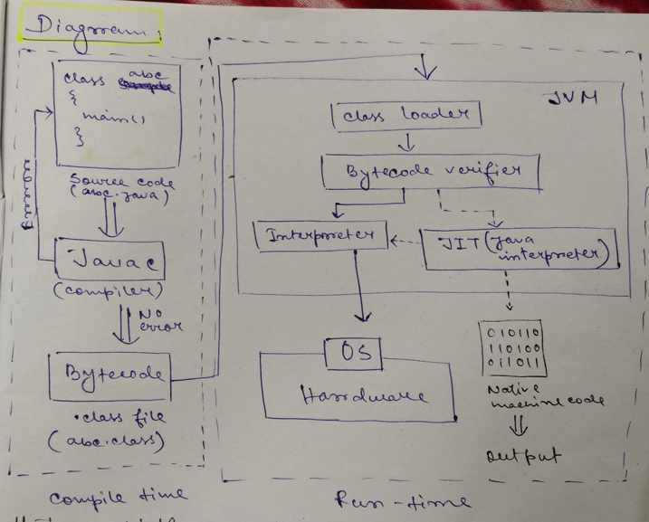
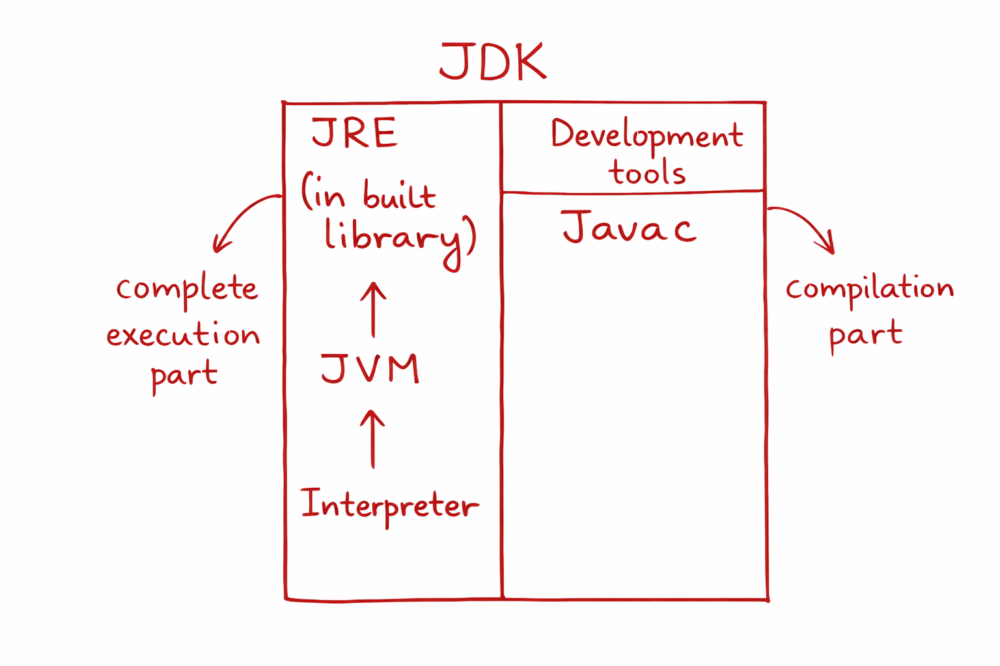

📘 How Java Program Runs
🔹 1. Source Code:
    Source code is created and saved as: filename.java   (.java extension)
🔹 2. Compilation:
    Compiler checks the source code and checks:
    1. Syntax
    2. Semantics (line by line)

If no error is found → Java compiler (javac-java development tool) creates:

Bytecode / .class file / intermediate code

🔹 3. Bytecode:

System does not directly understand bytecode, so interpreter converts bytecode into binary language code that the system can understand. interpreter checks the whole code line by line.

Bytecode is:

- Platform independent

- Same on all systems

- Can run on any JVM

- Does not depend on OS/hardware

🔹 4. Execution:

JVM converts the bytecode into platform specific machine code (binary code/low level language)at runtime that can be executed by the system.

JVM is:
- Platform dependent (different for each operating system: Windows, Linux, macOS)
- Interacts directly with OS and hardware to execute the program.
- Converts bytecode to machine code at runtime (not before)
- platform  specific (depends on OS and hardware).



## 🔹 Java Platform Components
### ✔ JDK

* Java Development Kit
* Contains:

  * JRE
  * Compiler (javac)
  * Debugger
  * Development tools

---

### ✔ JRE

* Java Runtime Environment
* Contains:

  * JVM
  * Core libraries
* Used to run Java program

### ✔ JVM

* Java Virtual Machine
* Executes Java bytecode
* (Heart of Java)

---
# 📊 Diagram 2: Java Platform (JDK, JRE, JVM)

```
        ┌────────────────────────────────────┐
        │               JDK                  │
        │  (Development Tools, javac, etc.)  │
        │                                    │
        │   ┌────────────────────────────┐   │
        │   │            JRE             │   │
        │   │   (Libraries + Runtime)    │   │
        │   │                            │   │
        │   │   ┌────────────────────┐   │   │
        │   │   │        JVM         │   │   │
        │   │   │                    │   │   │
        │   │   │   Interpreter      │   │   │
        │   │   └────────────────────┘   │   │
        │   └────────────────────────────┘   │
        └────────────────────────────────────┘
```

---

## 🔹 JVM – Main Components

* **Class Loader** → loads class files
* **Bytecode Verifier** → checks code for security
* **Execution Engine**

  * Interpreter
  * JIT compiler
* **Garbage Collector**
* **Runtime Memory Areas**

  * Heap
  * Stack
  * Method Area
  * Program Counter Register

  

---
## 🔹 WORA Concept
* Java follows **WORA (Write Once Run Anywhere)** architecture

## 🔹 Structure of Java Program

```java
class ClassName
{
    public static void main(String[] args)
    {
        // statements
    }
}
```
## 🔹 Important Points:
* `main()` → used to execute the code
* JVM stops execution when `main()` ends

---