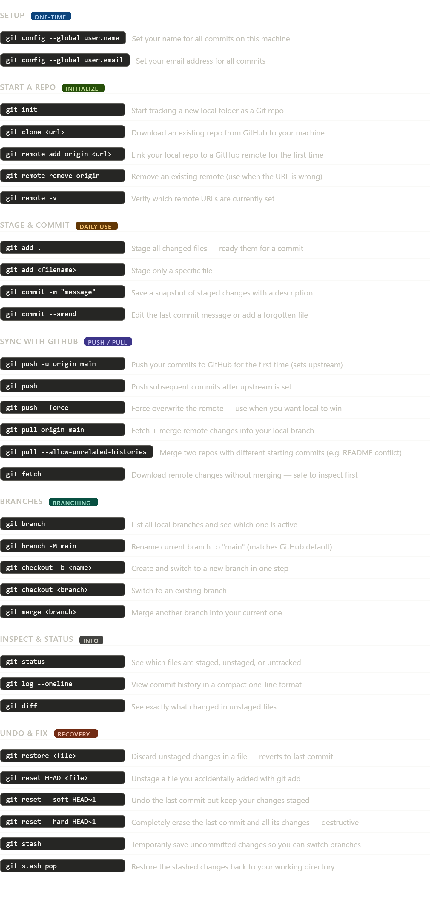

Here's a comprehensive overview of Git commands with their situations:Here's a quick summary of the categories:

**Setup** — run once when you first install Git on a machine to attach your identity to commits.

**Start a repo** — everything you need to either create a fresh local repo or connect it to GitHub. This is where your earlier error was — the remote URL was stale.

**Stage & Commit** — your everyday loop: `add` selects what to snapshot, `commit` saves it.

**Sync with GitHub** — `push` sends your work up, `pull` brings remote changes down. The `--allow-unrelated-histories` flag is specifically for the situation you just hit.

**Branches** — create isolated lines of work, merge them when ready.

**Inspect & Status** — non-destructive commands to understand the current state of things at any time.

**Undo & Fix** — recovery commands ranging from gentle (`restore`, `stash`) to destructive (`reset --hard`). Always double-check before using `--hard` or `--force`.