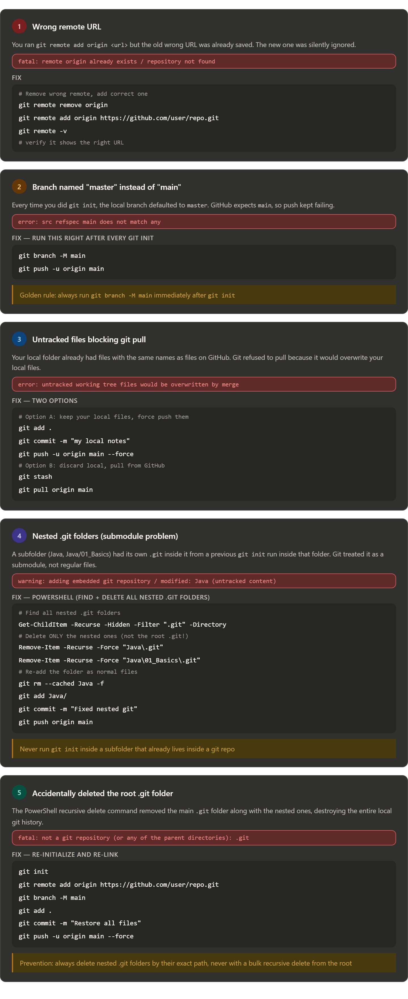

Here's a full breakdown of every issue you hit and the exact fix for each:Here's a quick summary of the root causes behind all your issues:

**Issue 1** stemmed from blindly running `git remote add` without checking if a remote already existed — always run `git remote -v` first.

**Issue 2** happened because `git init` always creates a `master` branch by default on Windows. GitHub uses `main`. This one hit you 3 times across the session.

**Issue 3** occurred because you had files locally before pulling — Git protects you from accidentally losing them, so it blocks the pull.

**Issue 4** was the trickiest — a previous `git init` run inside the `Java` or `Java/01_Basics` subfolder left a hidden `.git` inside it, making Git think it was a separate repo (submodule).

**Issue 5** was a consequence of fixing Issue 4 the wrong way — the bulk recursive delete didn't distinguish between the root `.git` and the nested ones.