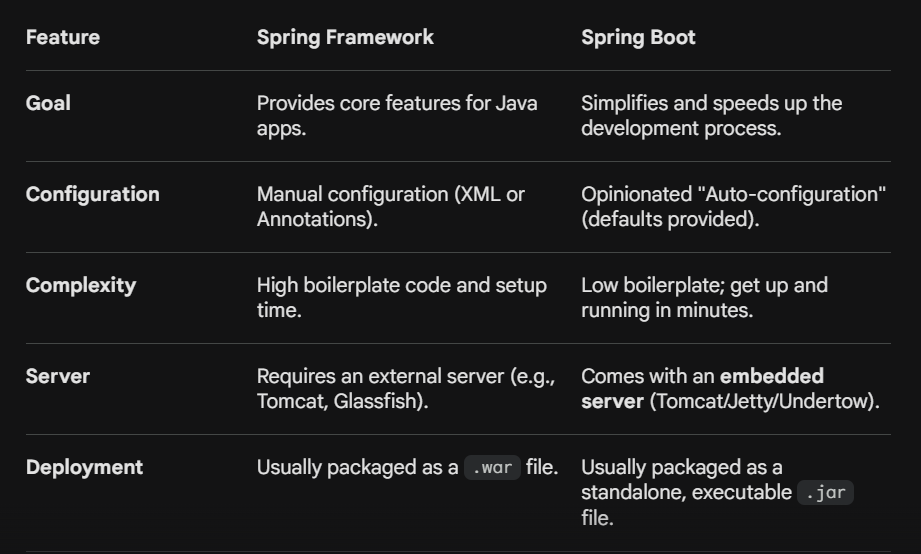

## What is Spring?

The **Spring Framework** is an open-source, lightweight Java platform that provides comprehensive infrastructure support for developing Java applications. Think of it as a massive toolbox that handles the "plumbing" of an application—like managing database connections or security—so you can focus on writing the actual business logic.

Its core features include:

* **Inversion of Control (IoC):** Instead of you manually creating objects, the Spring container manages them for you.
* **Dependency Injection (DI):** A way to supply objects that a class needs, making your code easier to test and maintain.
* **Aspect-Oriented Programming (AOP):** Allows you to separate "cross-cutting" concerns (like logging or security) from your main code.

---

## What is Spring Boot?

Spring boot is a framework for building applications in java language. it provides some tools and libraries by which, we implement the application in a very easy way. it is an extension of the spring framework. it is used to create stand-alone, production-grade Spring based Applications that you can "just run". It takes an opinionated view of the Spring platform and third-party libraries so you can get started with minimum fuss. Most Spring Boot applications need minimal Spring configuration.

core spring framework reduces boilerplate code. however, spring boot helps to reduce manual configuration and setup of the spring application. it provides a lot of features like auto-configuration, starter dependencies, embedded servers, etc. it is designed to simplify the bootstrapping and development of new Spring applications.

**Spring Boot** is an extension of the Spring framework. If Spring is the toolbox, Spring Boot is the **pre-assembled workstation**. It was created to solve the "configuration fatigue" that developers faced with Spring.

Before Spring Boot, setting up a Spring project required writing huge amounts of XML or Java configuration. Spring Boot automates this with three main pillars:

* **Auto-Configuration:** It looks at your project and automatically configures beans based on what you have added (e.g., if it sees a database driver, it sets up a data source automatically).
* **Starter Dependencies:** These are curated sets of libraries (e.g., `spring-boot-starter-web`) that bundle everything you need for a specific task.
* **Embedded Servers:** It includes a web server like Tomcat inside the application, so you don't need to install one separately.

---

## **Key Differences**

---

### **The "New Kitchen" Analogy**

* **Spring** is like buying all the individual appliances, pipes, and wires. You have total control, but you have to install everything yourself before you can cook.
* **Spring Boot** is like a pre-furnished kitchen. The stove is plugged in, the fridge is cold, and the layout is set based on "best practices." You can still change things, but you can start cooking immediately.

##  Basic terminology:

### **1. Open-Source Java Platform**

In the world of software, **"Open-Source"** means that the original source code (the human-readable instructions written by programmers) is made freely available to the public.

* **Transparency:** Anyone can inspect the code to see exactly how it works or check for security flaws.
* **Collaboration:** A global community of developers contributes to fixing bugs and adding new features.
* **No Licensing Fees:** You don't have to pay a company like Microsoft or Oracle to use the Spring Framework in your project.
* **The "Platform" Aspect:** It isn't just a single tool; it is an entire ecosystem (a platform) that supports everything from web apps and big data to security and cloud services.

---

### **2. Standalone Executable File**

In traditional Java development, if you built a web application, you would get a `.war` (Web Archive) file. To run it, you had to manually install a web server (like Apache Tomcat) on your computer, configure it, and then "deploy" your file into that server.

A **Standalone Executable** (usually a `.jar` file in Spring Boot) changes this:

* **Self-Contained:** The web server is actually **inside** the file.
* **"Just Works":** You don't need to install any external software except for the Java Runtime.
* **Portability:** You can take that one file, move it to any computer or cloud server, and run it with a single command: `java -jar your-app.jar`.

---

### **3. Boilerplate Code**

**Boilerplate** refers to sections of code that have to be included in many places with little or no alteration. It is the "repetitive setup" code that doesn't actually perform any of your unique business logic but is required for the program to function.

**Examples of Boilerplate in Java:**

* Writing **Getters and Setters** for every single variable in a class.
* Setting up **Database Connections** (opening the connection, handling errors, closing the connection).
* Writing the code to **Convert JSON** data into Java objects.

> **Why it matters:** Excessive boilerplate makes code harder to read and increases the chance of making a typo or a small error in a repetitive task. Spring and Spring Boot use **Annotations** (like `@Service` or `@RestController`) to handle this work behind the scenes, allowing you to write 10 lines of code instead of 100.

## why springboot can make standalone application with help of tomcat server?

The reason Spring Boot can create standalone applications is due to a feature called **Embedded Containers**.

In a traditional Java web application, the relationship between your code and the server was like a **Tenant and a House**: your code (the tenant) had to be moved into a pre-existing, separately installed web server like Tomcat (the house) to live and run.

Spring Boot flips this: it puts the **House inside the Tenant**.

---

### **How it Works: The Mechanics**

#### **1. Embedded Tomcat**

When you add the `spring-boot-starter-web` dependency to your project, Spring Boot automatically includes the Tomcat library (the `.jar` files) as part of your application’s dependencies.

* Tomcat is no longer a separate software installed on your computer.
* It is treated as just another Java library that your application uses.

#### **2. The Fat JAR (Executable JAR)**

When you "build" a Spring Boot project, it creates what is known as a **Fat JAR**. Unlike a standard JAR, this file contains:

* Your compiled Java classes.
* All your project dependencies.
* **The entire Tomcat server source code.**

#### **3. Programmatic Startup**

In a standard app, you start Tomcat, and then Tomcat starts your app. In Spring Boot, your `main()` method starts first.

* When `SpringApplication.run()` is called, Spring Boot manually creates an instance of the Tomcat class.
* It configures the port (default 8080) and starts the server engine.
* Because the server is started via code, the application is **standalone**—it carries its own environment with it.

### **Can you change the server?**

Yes! Because Spring Boot is highly flexible, you aren't stuck with Tomcat. By simply swapping a dependency, you can tell Spring Boot to embed **Jetty** or **Undertow** instead. It will still be a standalone application, just with a different "engine" inside.

