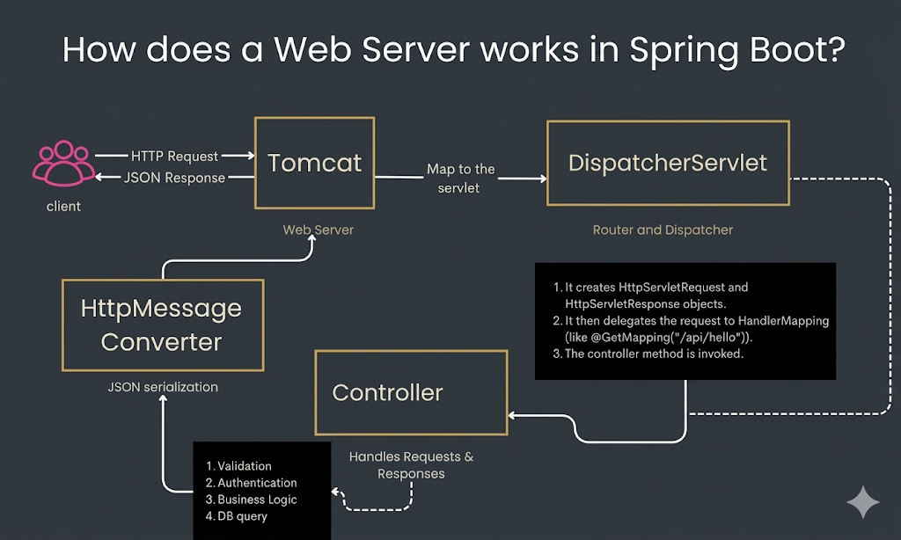

## How does a web server works in springboot?
In Spring Boot, the "Web Server" works differently than in traditional Java applications because it is **embedded**.

Here is the step-by-step breakdown of how it handles a request:
### **1. The Embedded Server Starts**

When you run the `main()` method of your Spring Boot application, it doesn't just run your code—it actually starts an internal web server (usually **Apache Tomcat**).

* In traditional Spring, you had to install Tomcat on your computer separately.
* In Spring Boot, Tomcat is just a library inside your `.jar` file. It starts up on port **8080** by default.

### **2. The DispatcherServlet (The Front Controller)**

Once the server is running, it waits for a "Request." Every single request that hits your server is caught by a special Spring component called the **DispatcherServlet**.

Think of the DispatcherServlet as a **traffic cop**. It doesn't know how to handle your business logic, but it knows exactly which part of your code does.

### **3. Handler Mapping**

The DispatcherServlet looks at the URL of the request (e.g., `/api/users`) and consults the **Handler Mapping**. It asks: *"Which Controller has an annotation for `/api/users`?"*

### **4. The Controller (Your Code)**

Once the correct **Controller** is found, the DispatcherServlet passes the request to it.

* The Controller might talk to a **Service** layer.
* The Service might talk to a **Database** (Repository).
* The Controller then returns the data (usually a Java Object).

### **5. View Resolver / Message Converters**

Since browsers and mobile apps don't understand Java Objects, Spring Boot uses **Message Converters** (like Jackson) to automatically turn that Java Object into **JSON** or **XML**.

### **6. The Response**

The transformed data is sent back to the DispatcherServlet, which finally pushes it back through the Tomcat server to the user's screen as an **HTTP Response**.

---

### **Summary of the Internal Pipeline**

1. **Request** arrives at Tomcat.
2. **DispatcherServlet** intercepts it.
3. **Handler Mapping** finds the right `@RestController`.
4. **Controller** executes your logic.
5. **HttpMessageConverter** turns your result into **JSON**.
6. **Response** is sent back to the client.

