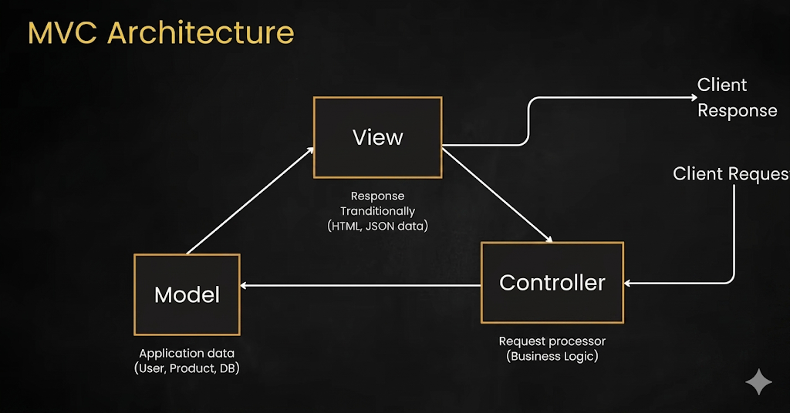
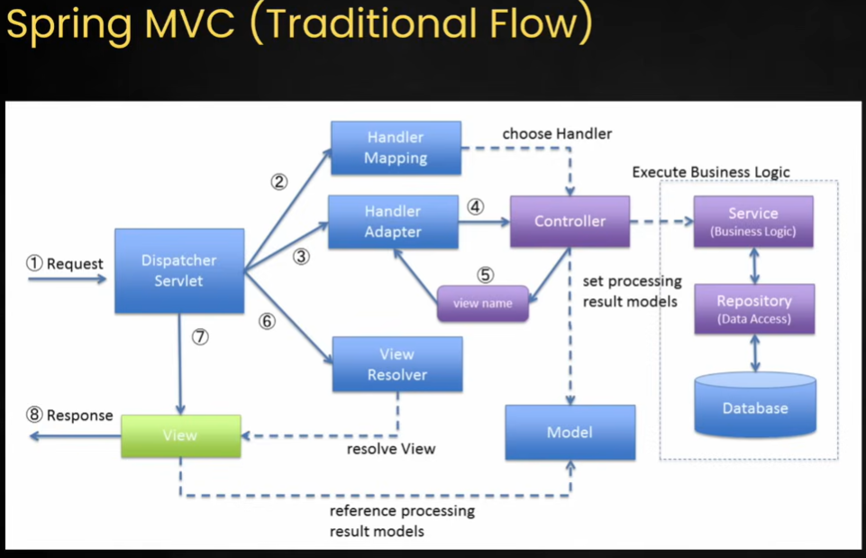
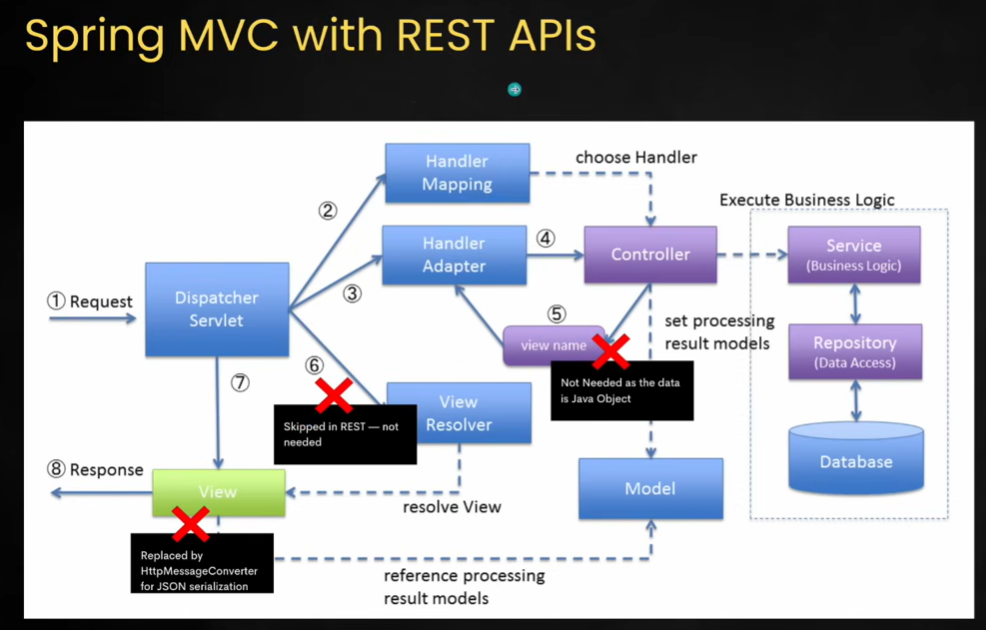

## MVC Architecture in Spring Boot:

The **MVC (Model-View-Controller)** architecture is a design pattern used to separate an application into three main logical components. This separation helps manage complex applications, as it allows you to work on the data, the logic, and the interface independently.

Here is a breakdown of the three components as shown in the diagram:
### **1. The Model (Application Data)**

The **Model** represents the "Shape" of the data and the business logic. It manages the data, logic, and rules of the application.

* **What it does:** It talks to the database, fetches data, or saves new information.
* **In Spring Boot:** These are usually your **Entity** classes (representing database tables) and **Repository** interfaces.
* **Example:** If you have a User app, the Model contains the `User` object (Name, Email, Password) and the logic to save that user to a database.

### **2. The View (The Presentation)**

The **View** is what the user sees. It is the front-end part of the application.

* **What it does:** It renders the data provided by the Model into a format the user can understand (like HTML, CSS, or JSON).
* **In Spring Boot:** This could be a template engine like **Thymeleaf** (for HTML) or, more commonly today, a **JSON response** that a mobile app or React/Angular frontend displays.
* **Example:** A profile page showing the user's name and photo.

### **3. The Controller (The Brain)**

The **Controller** acts as an interface between the Model and the View. It processes all incoming requests.

* **What it does:** It takes the "Request" from the client, decides which "Model" logic to trigger, and finally tells the "View" what to display.
* **In Spring Boot:** These are classes annotated with `@RestController` or `@Controller`.
* **Example:** When you click "Login," the Controller receives your credentials, asks the Model to check if they are correct, and then tells the View to either show the "Dashboard" or an "Error Message."

---

### **How the Cycle Works (The Flow)**

1. **Request:** The user interacts with the **View** (e.g., clicks a "Submit" button) which sends a request to the **Controller**.
2. **Action:** The **Controller** receives the request and asks the **Model** to perform a specific task (like "Find user with ID 10").
3. **Data:** The **Model** performs the task and returns the raw data back to the Controller.
4. **Update:** The **Controller** takes that data and sends it to the **View**.
5. **Response:** The **View** renders the final page/data and sends it back to the user's screen.

### **Why use MVC?**

* **Simultaneous Development:** One developer can work on the CSS (View) while another works on the Database logic (Model) without breaking each other's code.
* **Reusability:** You can use the same Model (data) for a web page View and a mobile app View.
* **Ease of Maintenance:** If you want to change how the data looks, you only touch the View; you don't have to touch the database logic.

